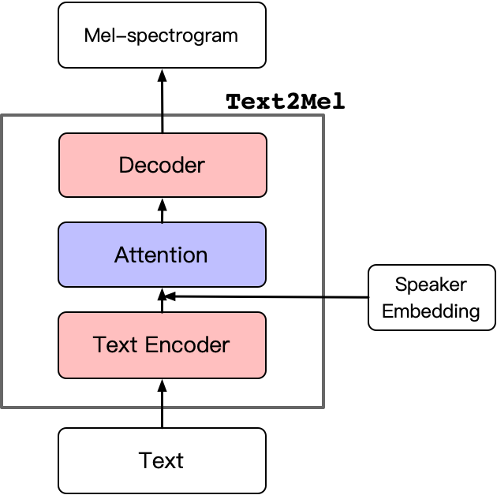
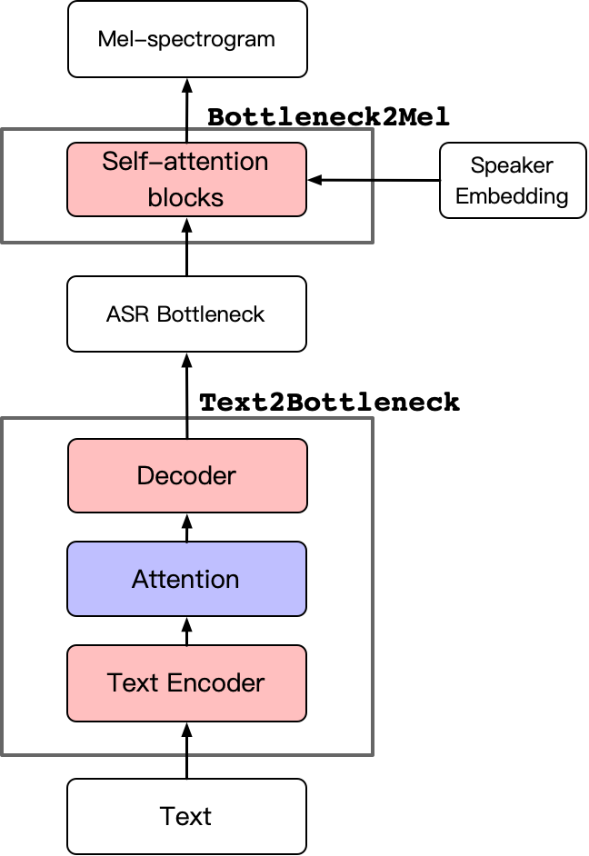

# Hieratron 介绍
### 音色克隆简介
+ 音色克隆是语音合成（Text-to-Speech, TTS)下面的一个子方向。
	+   语音合成（Text-to-Speech），顾名思义，模型输入文字输出对应的语音。
	+   音色克隆：模型生成语音的同时，可以定制所生成语音的音色。比如，对于百度地图导航，用户上传几分钟自己的录音，APP即可以按照自己的声音导航。

### 主要工作
+ 提出模型框架的改进，降低模型对数据的需求。实现极少量目标说话人数据下稳定的音色克隆以及音色克隆的同时加上其他控制（韵律、语言等）

### 音色克隆模型及流程（Original）
+ Text2Mel模型，通过输入文本直接预测Mel-spectrogram。(Mel-spetrogram 经过一系列变换后即可得到对应的wav，可直接认为Mel-spectrogram等价于最终生成的语音)
+ 先使用多说话人数据预训练(Pre-train)得到平均模型，再使用目标说话人数据微调(Fine-tune)平均模型。
+ 问题：
	+ 使用极少量目标说话人数据进行音色克隆 （Pre-train所使用的数据量越大，Fine-tune所需要的目标说话人数据越少，但收集上千说话人TTS数据成本很高）
	+ 如何在实现音色克隆的同时加上其他控制

### 改进思路
+ 引入中间特征（ASR bottleneck），把原来一个模型拆解成两个模型(Text2Mel -> Text2Bottleneck + Bottleneck2Mel)。
	+   先建模内容、时长、风格等信息；再建模音色信息。实现音色与其他特征硬分离。
	+   使用不同的数据训练不同的子模型，降低模型对数据的依赖。

### 模型结构

### 说明
+ Text2bottleneck 建模语音的韵律信息，bottleneck2mel 建模语音的音色信息。
+ 极少量目标说话人数据下稳定的音色克隆
  - bottleneck2mel 不需要任何标注信息，容易收集上千说话人的数据用于预训练。
  - text2bottleneck 可以只使用高质量单人的数据用于训练，保证合成结果的稳定。
+ 实现音色和其他语音特征相分离，在克隆音色的同时加上更多控制。
  - 使用Rap节奏的数据训练Text2bottleneck模块，实现跨风格音色克隆（Cross rap voice cloning)
  - 使用其他语言的数据训练Text2bottleneck模块，实现跨语言音色克隆（Cross lingual voice cloning)
+ Demo:  [https://daidongyang.github.io/hierademo/index.html](https://daidongyang.github.io/hierademo/index.html)
